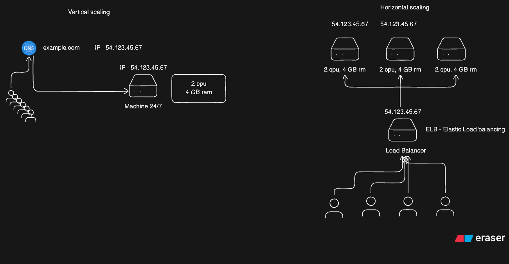
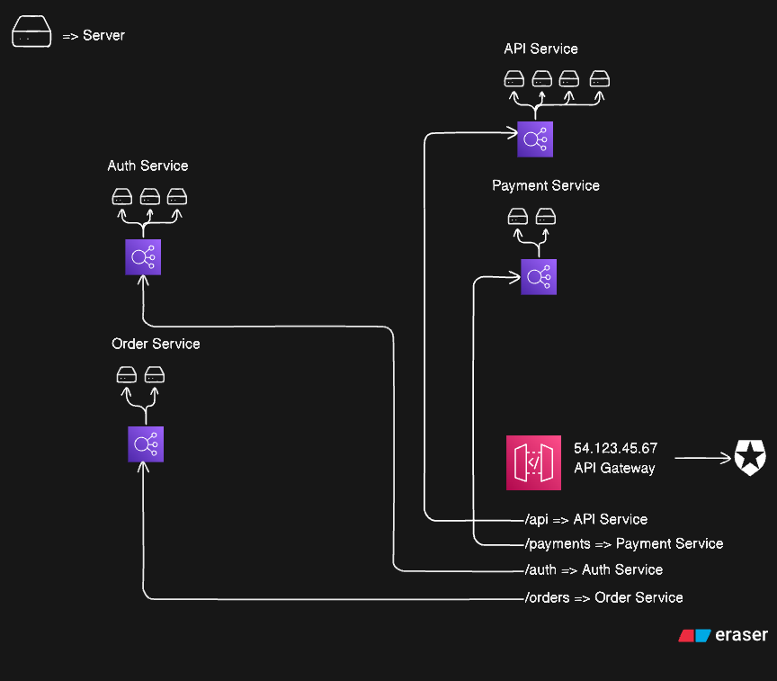

# Request to Response: The Full Flow

This document outlines the journey of a request from a user's browser to a back-end service, covering DNS, networking protocols, and cloud infrastructure.

---

## 🌐 1. The Entry Point: DNS

When a user visits `example.com` (via **HTTP** or **HTTPS**), the browser first interacts with the **DNS (Domain Name System)** to resolve the human-readable domain into an **IP Address** (e.g., `54.123.45.67`).

## 📨 2. The Transport Layer: TCP

HTTP and HTTPS operate on top of the **TCP (Transmission Control Protocol)**.

- **HTTP/HTTPS**: Carries the plain text or encrypted data.
- **TCP**: Breaks the request into several packets.

Each packet contains:

- **Destination IP**: `54.123.45.67` (The AWS server IP).
- **Sequence Number**: Ensures packets are reassembled in the correct order.
- **Data**: A chunk of the actual HTTP/HTTPS request.

---

## ☁️ 3. AWS Infrastructure & Networking

Once the packets reach AWS, they enter the **Internet Gateway**—the "front door" of your **VPC (Virtual Private Cloud)**.

> [!NOTE]
> The Internet Gateway connects your VPC to the internet, routing incoming traffic by mapping public IP addresses to private IPs within your VPC.

---

## ⚖️ 4. Scaling Strategies

Traffic can be handled in two main ways:

- **Vertical Scaling**: Directly hitting a single server. You increase the infrastructure (CPU/RAM) of that specific machine.
- **Horizontal Scaling**: Introducing a **Load Balancer** to distribute traffic across multiple instances.

### Scaling Diagram

---

## 🛡️ 5. API Gateway & Routing

When traffic reaches an **API Gateway**:

1. **Security**: If the request is HTTPS, it validates **SSL/TLS** certificates.
2. **Health Checks**: The gateway identifies and routes traffic only to **healthy services** or EC2 instances.
3. **Service Discovery**: It routes the user to a specific service based on the path.
4. **Rate Limiting**: It limits the number of requests from a specific user or IP address.

**Example Routing:**

- `/auth` → Authentication Service
- `/api` → Core API Service
- `/mail` → Mailing Service

---

## 🏁 Full Flow as a Diagram for Microservices

